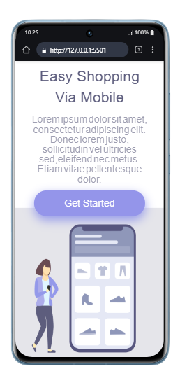

# 📱 Primeiro Projeto Responsivo — HTML & CSS

Este é o meu primeiro projeto de site responsivo, desenvolvido com foco em praticar os conceitos de **responsividade**, **semântica HTML** e **estilização com CSS**.  
A proposta é criar uma página que se adapte bem a diferentes tamanhos de tela — desde celulares até desktops — utilizando boas práticas de layout e design.

---


## 🧩 Layout Responsivo




---
## 🚀 Objetivos do projeto

- ✅ Aplicar estrutura semântica com HTML5  
- 🎨 Estilizar a página com CSS3  
- 📱 Tornar o site responsivo para diferentes dispositivos  
- 📚 Praticar organização de arquivos e boas práticas de código  

---

## 🛠 Tecnologias utilizadas

- **HTML5** → Estrutura da página  
- **CSS3** → Estilização e responsividade  
- (Opcional) **Media Queries** → Adaptação do layout para diferentes resoluções  

---

## 📂 Estrutura de arquivos

```plaintext
📁 Primeiro-projeto-responsivo/
├── pjpt2-1.html       → Página principal
├── pjpt2-1.css        → Estilos da interface
└── assets/            → Imagens e ícones (se houver)
```
---
▶️ Como visualizar o projeto


1- Faça o download ou clone o repositório:

```bash
git clone https://github.com/Klausdmkb/Primeiro-projeto-responsivo.git
```

- Navegue até a pasta do projeto

- Dê dois cliques no arquivo pjpt2-1.html para abrir no navegador

- Redimensione a janela ou abra em diferentes dispositivos para testar a responsividade!

---

## 📄 Licença

-Este projeto foi desenvolvido com fins educacionais como parte dos estudos realizados na plataforma *DevClub, sob orientação do professor **Rodolfo Mori*.

-Você pode utilizar, modificar e compartilhar este código livremente para fins de aprendizado e prática pessoal.  
-Caso deseje utilizar em projetos públicos ou comerciais, recomenda-se manter os créditos originais.

*Todos os direitos de ensino e metodologia pertencem ao DevClub e Rodolfo Mori.*

🚀 Aprenda mais em: [https://devclub.com.br](https://devclub.com.br)
